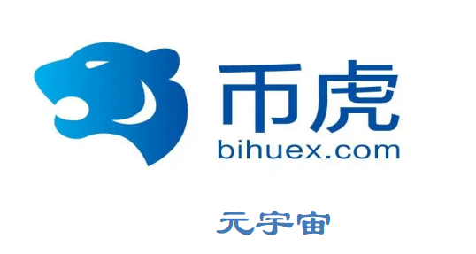

旨在收集所有对竞争币的潜力进行定量和定性排名所需的数据，计划根据我们的算法对货币进行基准衡量来确定货币与其同类相比的价值。

说起币虎交易所，很多币圈新手可能还不太了解，币虎交易所也算得上是一个比较老牌的数字货币交易所，距今已经成立了四年的时间。币虎交易所是一个面向全球的加密数字资产交易平台，支持BTC、ETH等各种主流币与非主流币的交易。

说起[币虎](https://hgaodu.com/pingtai/76.html)交易所，很多币圈新手可能还不太了解，币虎交易所也算得上是一个比较老牌的数字货币交易所，距今已经成立了四年的时间。币虎交易所是一个面向全球的加密数字资产交易平台，支持BTC、ETH等各种主流币与非主流币的交易。截止到2021年7月26日10:44，该交易所的资产已经达到了22.26万美元，有410个交易对和321个币种，24小时交易量为542.98亿美元，可以看出币虎交易所在市场上还是比较受欢迎的。

币虎交易所来自于新加坡，成立于2017年11月。币虎(CoinTiger)是全球领先的数字资产金融平台，提供法币、币币、合约、ETF、理财、打新、社区等全栈服务，构建基金、孵化器、安全联盟、骑兵团、全球合伙人等完整生态。2017年创办至今，币虎在韩国、日本、俄罗斯、意大利等多地建立运营中心。截止2020年7月，注册用户超过350万，来自158个国家和地区。币虎是业界一家实行币股同权的交易服务平台，公司股权100%注入平台币TCH。币虎始终把用户放在第一，以国际顶尖撮合引擎，银行级别安全措施，丝滑细腻产品体验，方便快捷交易服务，7X24客服团队，为用户提供安全、稳定、可信赖的服务。

CoinTiger交易平台的使命是为全球广大的数字资产爱好者提供优质的数字货币资产，和安全、可靠的交易服务。CoinTiger平台的交易系统获得了国际顶尖的交易撮合技术团队的支持，能够为用户提供堪比国内外成熟券商水平的稳定系统。

CoinTiger的管理团队是由一批互联网金融行业的创业老兵，同时也是区块链行业的早期爱好者组成的多样化团队，拥有丰富的国际金融市场社群、游戏的创业经验，带领实力雄厚的产品研发团队、丰富海外推广经验的运营、市场推广团队，致力于打造体验一流的数字资产交易平台。除了数字货币交易服务，CoinTiger还另外开辟了CoinTiger labs，致力于拓展区块链上游企业，主动发现优质数字货币资产，为区块链行业做出贡献，为广大投资者提供更多优质的交易资产。

币虎交易所很靠谱。CoinTiger币虎自17年10月发布至今，由于其技术性优秀，买卖全透明公平公正，被众多的顾客所青睐，被大家称为最好是的虚拟货币平台交易。CoinTiger币虎服务平台有别于别的的互联网虚拟货币平台交易，CoinTiger币虎服务平台是一个以正当竞争，为关键创建的真实的虚拟货币平台交易，由SINGAPORETAI-ECYBER-TECHPTE.LTD与著名的网络游戏开发设计营运商、日本上市企业Skymoons(KOSDAQ：033790)相互进行创立。

CoinTiger将来还将在中国台湾、日本国、泰国、澳大利亚、加拿大、美国等多地创立合资企业，朝向亚洲地区和国际性客户出示业内一流的数据币币交易感受。

综上所述，就是币游小编对于币虎交易所是哪个国家的这一问题的回答以及对于CoinTiger交易所成立时间的介绍，希望能够帮助到各位投资者。币游小编友情提醒各位投资者，在选择数字货币交易所时一定要谨慎，要知道，市面上有很多数字货币交易所是不值得信赖的，如果我们想知道币虎交易所是否值得信赖，那我们可以从币虎交易所的资金安全，用户隐私安全，客服服务效率，处理问题速度等多方面去考察，只有这样才能最大限速的保障我们数字资产的安全。

支持bitcny充值、支持法币、币币交易。

CoinTiger平台是一家面向全球的创新数字资产交易平台，为全球的区块链爱好者提供多币种、多语言的现货币对交易服务。 CoinTiger交易平台的使命是为全球广大的数字资产爱好者提供优质的数字货币资产，和安全、可靠的交易服务。CoinTiger平台的交易系统获得了国际顶尖的交易撮合技术团队的支持，能够为用户提供堪比国内外成熟券商水平的稳定系统。