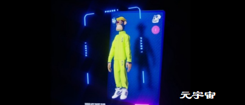

众筹IDO项目数据库，查最新筹款项目数据，基本上囊括了圈内所有的项目融资情况，这同时也是一个发掘早期项目和测试交互的宝地。

**1.Dove Metrics报告：欧洲正试图成为DeFi中心**

Dove Metrics报告显示，随着美国加强加密行业监管，欧洲正在成长为DeFi中心。Dove Metrics深入研究欧洲的DeFi市场，结果显示尽管市场回落，监管压力加大，但情况看起来仍然健康。报告指出，56个欧洲DeFi团队已经共计融资2.82亿美元，占全球DeFi资金总额的20%左右。由欧元支撑的稳定币EURS今年也有增长势头，过去两个月的供应量翻一番，达到8860万欧元（价值约1.05亿美元）。报告称，“在Argent、Aave、Centrifuge和Nexus Mutuall等成功案例引领下，现在欧洲正试图将自己定位为一个加密中心。”

**2.数据：以太坊DeFi应用的唯一地址数超300万**

7月28日消息，根据Dune Analytics最近的统计数据，以太坊上去中心化金融（DeFi）协议的唯一地址数量已经超过300万。其中，约有240万地址在使用去中心化交易所（dex）平台Uniswap。DeFi借贷应用Compound则有约326,723个地址，流动性协议1inch有约276,924个地址。在Uniswap、Compound和1inch之后，分别是Sushiswap、Balancer和Kyber等DeFi应用。

**3.美参议员：大多数DeFi衍生工具违反了美国商品法**

金色财经报道，今日在参议院银行委员会的听证会上，参议员Tina Smith表示，大多数DeFi衍生工具违反了美国商品法，CFTC专员Dan Berkovitz也赞同这一观点。Smith随后提到了比特币的巨大碳足迹，她对加密货币可以变为绿色的论点表示不屑一顾。

**4.1inch基金会计划分发1000万个代币以抵消gas成本**

7月28日，1inch基金会在公告中表示将开始分发1000万个原生1INCH，以退还持有代币的用户的gas费用。据悉，任何通过其应用进行质押的用户都将在每个月的第一天退还以1INCH代币支付的gas金额。

**5.Aave招募去中心化社交媒体相关的高级后端开发者**

Aave首席运营官JordanLazaroGustave发推确认，Aave正在招募去中心化社交媒体相关的高级后端开发人员。 此前报道，7月17日Aave创始人StaniKulechov发推暗示要在以太坊上开发推特：鉴于JackDorsey（推特创始人）将在比特币上构建Aave，Aave也应该在以太坊上构建推特。

**6.代币化和众筹DeFi平台AMPnet将推出V2版本**

据官方公告，代币化和众筹DeFi平台AMPnet将推出V2版本，据悉，AMPnet是可扩展和去中心化的DeFi平台，可用于真实世界资产的代币化和众筹。

**7.DeFi衍生品协议Vega宣布将于9月发布第一版软件**

DeFi衍生品协议Vega宣布将于9月发布第一版协议软件，独立验证节点将能够运行首个Vega网络，开启受限主网的阶段，也是三个启动阶段中的第二步。在该阶段中，公共的Vega链将上线，可以进行质押和治理。在受限主网的阶段中，将有13名验证者，之后社区可以逐渐增加验证人的数量。

**8.KSwap将于7月29日主网上线**

据官方消息，Kswap主网将于北京时间7月29日下午2点正式上线，下午4点开启主网矿池。 KSwap是一个部署在OKExChain上的去中心化交易平台。作为一个DEX，KSwap基于成熟的资金池自动做市算法（AMM）实现了数字货币的兑换，以及流动性挖矿与交易挖矿等多种挖矿机制，同时也率先推出KUniverse和KStarter等产品，探索更多玩法，满足更多用户的需求。在前期举办的OKExChain Grant HackerLink黑客松中，KSwap获得评委投票第一名的好成绩。

**9.DeFi七点钟基金加入XZ公链节点**

据官方消息，7月28日，DeFi区块链基金七点钟基金宣布加入XZ公链节点，助力XZ公链价值全面落地，XZ节点开启全球性布局。 据悉，XZ公链是以修正智能药柜为节点的数据存储公链，通过“NFT+IPFS”构建了一个链上数据库体系，最终实现覆盖端、边、云的全栈式场景应用和跨终端无缝协同的健康医疗服务体验，打造从药企到终端、从线下到线上的新零售闭环生态体系。 DeFi七点钟基金专注投资DeFi、NFT、WEB3.0、国内外公链、存储等领域基础应用设施，致力于发展和推动去中心化金融。

## **NFT**

**1.V神参与的NFT动画系列StonerCats35分钟售罄 Gas上涨至600gwei以上**

7月28日消息，由女演员MilaKunis推出的NFT动画系列StonerCats于今日开售，每只售价0.35ETH。据悉，这10,000个代币在35分钟内售罄，导致以太坊Gas价格上涨至600gwei以上。StonerCats是MilaKunis推出的动画系列，由ChrisRock、AshtonKutcher和SethMcFarlane等配音演员配音，以太坊创始人VitalikButerin也为一只名叫Catsington的猫进行了配音。

**2.可口可乐将与Tafi合作首次推出NFT收藏品**

头像和数字可穿戴设备设计平台Tafi宣布与可口可乐（Coca-Cola）达成合作，为可口可乐首次推出的NFT收藏品设计虚拟可穿戴设备。为了庆祝国际友谊日（7月30日），可口可乐将在NFT市场OpenSea拍卖NFT战利品箱，其中包含Tafi设计的数字服装，可以在去中心化虚拟世界中永远穿戴。OpenSea拍卖将于UTC时间7月30日00:01（北京时间8:01）开始，并于UTC时间8月2日20:00（北京时间8月3日4:00）结束。可口可乐拍卖所得全部将捐赠给国际特奥会（Special Olympics International）。

**3.NFT基础设施Dematrix将于近期上线主网**

据官方消息，NFT与DeFi衍生品平台Dematrix正在进行OEC（OKEXChain）上的合约部署，并将于近期上线主网。Dematrix是OKexChain生态的去中心化产品矩阵，支持衍生品收益聚合的流动性服务和后续NFT资产的一站式基础设施建设，将在OKexChain主网上线后开启创世挖矿。此前Dematrix已完成了百万美元的机构轮融资。

**4.NFT卡牌链游Splinterlands完成360万美元融资，Yield Guild Games参投**

7月28日，NFT卡牌链游Splinterlands宣布完成360万美元代币私募轮融资，本轮融资由Animoca Brands、Blockchain Founders Fund、Enjin、Polygon、Yield Guild Games、Gate.io、3Commas Capital、Alpha Sigma Capital、AGE Crypto Asset Investment Fund、TechmeetsTrader 等参投。个人投资者包括 Ran Neuner以及Simplex和Sandbox创始人等。

**5.Theta宣布获得专利“去中心化数据传输网络中基于NFT的数字版权管理”**

官方消息，Theta宣布，正式获得了美国专利11075891“去中心化数据传输网络中基于NFT的数字版权管理（DRM）”。据介绍，内容权利持有人使用去中心化视频流的一个主要摩擦点是担心他们的内容权利受到侵犯，因为他们需要强有力的保证，即点对点网络不会被用来侵犯他们或他们的艺术家的内容权利。通过使用NFTs来实现去中心化的DRM，Theta网络以一种不需要中心化的一方在每次数据流传输时对用户进行身份验证的方式，为内容权利持有者解决了这个问题。这为全球内容品牌安全地将其视频、电影和游戏带到Theta去中心化的数据和视频交付网络打开了大门。

**6.IOST链上NFT交易平台与空间艺术家吴丹达成合作**

据官方消息，IOST生态项目“文艺复兴NFT交易平台”近日与空间艺术家吴丹达成合作，文艺复兴NFT交易平台将于本周上架吴丹的NFT艺术品。 吴丹是意大利米兰理工大学设计学博士、Hashtag Design Italia（HDI-Milan）设计联合创始人，同时担任意大利国家工业设计协会（ADI)中国大陆负责人，是一位跨文化、跨领域设计者，艺术类研究及评论者。 文艺复兴NFT交易平台是EMOGI Network（LOL）抽调精英团队打造的多链聚合型NFT交易平台，首发IOST公链，已于7月20日正式上线。EMOGI Network首期投资2000万美元成立“REVIVAL NFT基金”，旨在扶持新生代顶流艺术家，让全球范围内高价值的NFT艺术品于市场流通。

**7.NFT动画系列Stoner Cats成交额达365万美元 24小时成交额排名第二**

CryptoSlam数据显示，Vitalik参与配音的NFT动画系列Stoner Cats成交额达365万美元，24小时成交额排名第二，仅次于Axie Infinity。Stoner Cats交易过程中Gas费率最高一度达到500Gwei。